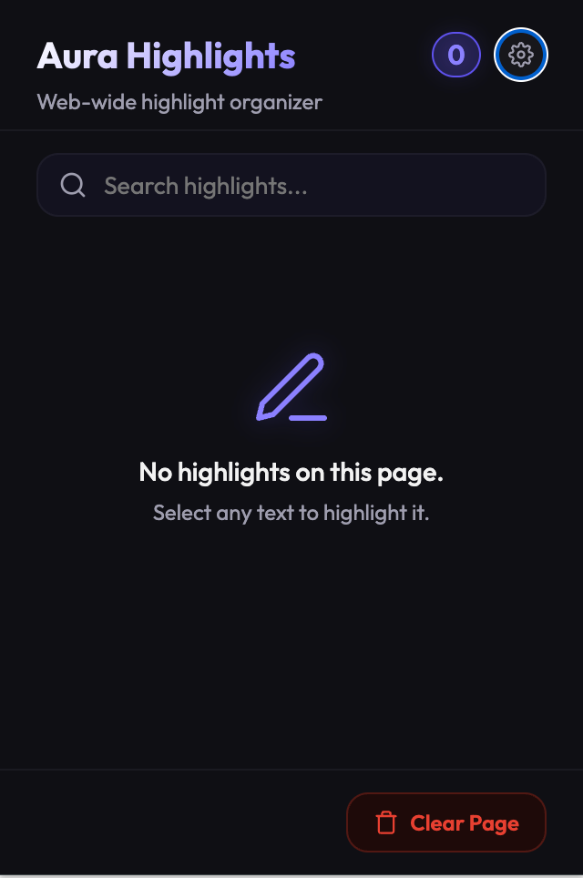
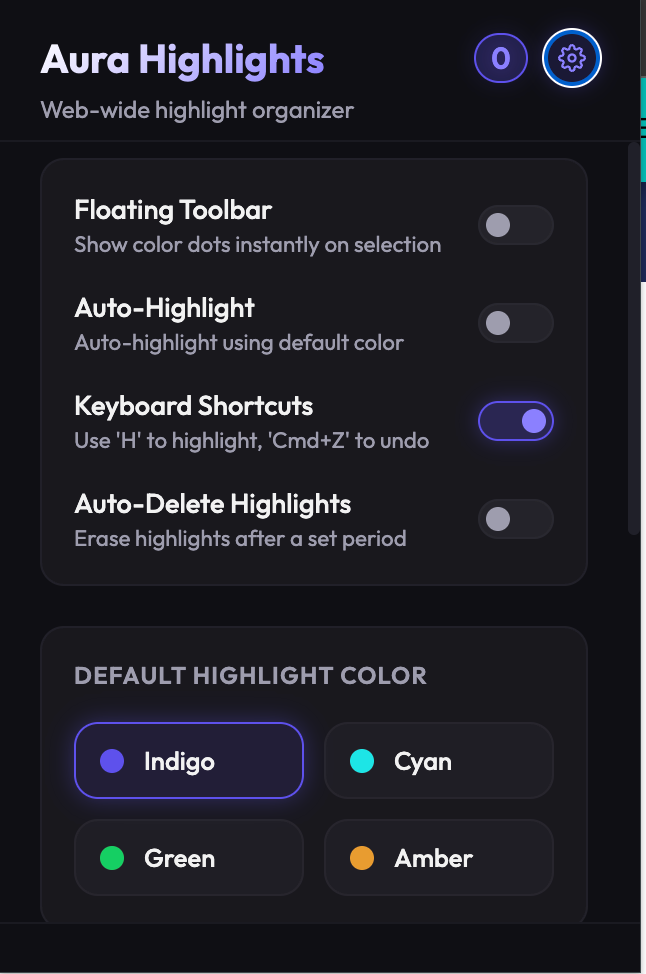
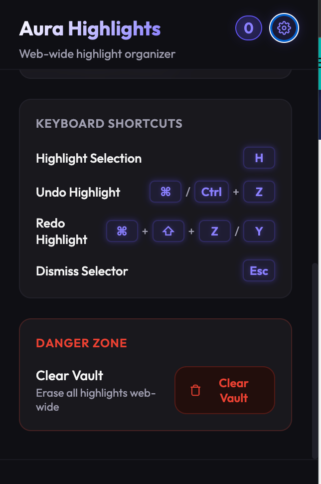

# Aura Highlighter

A premium, glassmorphic Chrome Extension for highlighting, organizing, and syncing web text. Aura Highlighter features dynamic text wrapping, host-domain organization, keyboard-driven navigation (undo/redo), and a local expiration database.

## Visual Interface

| Dashboard View | Settings Panel | Shortcuts & Operations |
|---|---|---|
|  |  |  |

---

## Features

- **Contextual Highlight Wrapper**: Wraps DOM text nodes safely using custom `mark` segments, maintaining page structure.
- **Domain-Grouped Dashboard**: Highlights are grouped by host domain with dynamic favicon fetching. 
- **Floating Toolbar**: Reveals HSL-based color picker buttons instantly upon text selection.
- **Auto-Highlight Mode**: Instantly highlights text with the default color upon selection, deactivating the floating toolbar.
- **Sequential Undo/Redo**: Employs an active redo stack to reverse (`Cmd+Z` / `Ctrl+Z`) or restore (`Cmd+Shift+Z` / `Ctrl+Shift+Z` / `Y`) highlights in order of execution.
- **Local Expiration Engine**: Automatically cleans up expired highlights at custom thresholds (15 minutes, 1 hour, 12 hours, 24 hours, 7 days, 30 days, or never).
- **Global Vault Operations**: Allows clearing highlights per-page, per-domain, or globally across the entire extension database.

---

## Keyboard Shortcuts

The extension monitors document keydown events in the capture phase to ensure operations intercept page-bubbling blocking.

| Command | Action | Supported Keys |
|---|---|---|
| **Highlight Selection** | Highlight active selection with default color | `H` |
| **Undo Highlight** | Remove the most recent highlight sequentially | `⌘ Z` (Mac) / `Ctrl Z` (Windows/Linux) |
| **Redo Highlight** | Restore the last undone highlight sequentially | `⌘ ⇧ Z` or `⌘ Y` (Mac) / `Ctrl ⇧ Z` or `Ctrl Y` |
| **Dismiss Menu** | Close active selection toolbar and clear range | `Esc` |

---

## Technical Architecture

- **Manifest Specification**: Manifest V3 (declarative listeners and background worker state).
- **Core Layer**: Vanilla JavaScript, semantic HTML5 structure, and native Browser Storage API (`chrome.storage.local`).
- **Styling Layer**: Outfitted with custom fonts (Outfit) and translucent glassmorphism (HSL, backdrop-filter, primary glow shadow boundaries).
- **Persistence Model**: Domain-keyed JSON array structure mapped to page URLs, resolving path hashes for anchor-based scroll targets.

---

## Installation

1. Clone the repository:
   ```bash
   git clone https://github.com/StealthMoud/Aura-Highlighter.git
   ```
2. Open Google Chrome and navigate to `chrome://extensions/`.
3. Enable **Developer mode** via the toggle in the top-right corner.
4. Click **Load unpacked** and select the root directory of this repository.

## Contribution

For issues or optimizations, submit a pull request or open an issue on the [Aura Highlighter GitHub page](https://github.com/StealthMoud/Aura-Highlighter).
